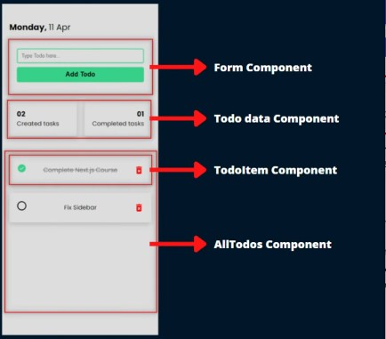
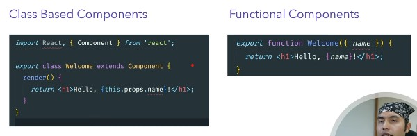

## Component Concept
- A component in React is like a JavaScript function or class that returns JSX (JavaScript XML), which looks similar to HTML.
- JSX allows you to write HTML-like code directly inside your JavaScript.
- Components are the building blocks of React applications, making it easy to create complex and interactive UIs by assembling reusable and isolated pieces.

## Two ways to create components in Reat.js
1. Class Based Components
- A class-based component is defined using the class keyword and extends React.Component to gain access to React features.
- search in chatgpt for interview

2. Functional Components (IMP)
- This is modern and recommended way of writing React.js components.
- A functional component is a plain JavaScript function that takes props as an argument and returns JSX.

