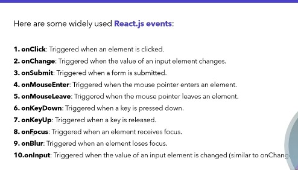

## Event Handling
- Event handlig in React.js is the process of capturing and responding to user interactions, such as clicks, keystrokes, or form submissions, within a React application. 
- Event handling in React follows similar pattern to standard JavaScript event handling but with some key differences, such as synthethic events for cross-browser compatibility and providing consitent event handling across different elements and browsers.

## What is SyntheticBaseEvent in React?
When you handle events in React, like clicking a button or typing in an input box, React wraps the native browser events in something called a SyntheticEvent.

## Basic Event Handlers 

## Event Naming Conventions
- Event names in JSX should be written in camelCase.
- For example: onClick, onChange.

## Function Naming Conventions
- Prefix with "handle" is a common convention to prefix event handler functions with "handle" to clearly indicate their purpose.
- For example: handleClick, handleChange, handleSubmit.
- Function names should be descripitive and reflect what the function does. 
- For example: handleFormSubmit instead of just handleSubmit if it is specifically for form submission. 