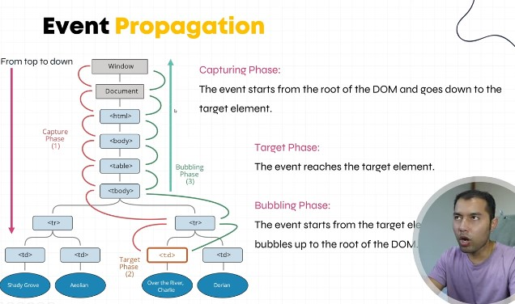

## Event Propagatin (Bubbling and Capturing)
- Event Propagation refers to the process of how events travel through the DOM hierarchy. 
- In JS, there are two phases of two event propagation i.e "capturing phase" and "bubbling phase"

## How to use bubbling and caputring phase 
- React follows the bubbling phase at first. 
- You can get the capturing phase by using "onClickCapture"

## Stopping the Propagation
- event.stopPropagation()

## When to use bubbling phase
- Bubbling phase chai tyo bela kaam lagcha, jasma div under div vako bela, aauta kunai event garda first div ko action vayera second div ko action hos tesari.

For Example => 
export function EventPropagation(){
    function handleGrandParent(){
        console.log("I am GrandParent,come at last due to buble phase")
    }
    function handleParentClick(event){
        console.log("I am Parent,come at second due to buble phase")
        // event.stopPropagation() // It stops the propagation means it can't reach to GrandParent
    }
    function handleChildClick(){
        console.log("I am child,come at first due to buble phase")
    }

    
    return(
        

            

                

                    <button onClick={handleChildClick}>
                        Child Div From the Event Propagation
                    </button>
                

            

        

    )
}

## When to use Capture Phase
- Jaba hami lai child div dekhi nai first ma action hudai janu cha grandParent Samma

export function EventPropagation(){
    function captureGrandParent(){
        console.log("I am GrandParent,come at first due to capture phase")
    }
    function captureParentClick(){
        console.log("I am Parent,come at second due to capture phase")
    }
    function captureChildClick(){
        console.log("I am child,come at last due to capture phase")
    }

    
    return(
        <>
        

            

                

                    <button onClickCapture={captureChildClick}>
                        Capturing Div From the Event Propagation
                    </button>
                

            

        

        </>
    )
}