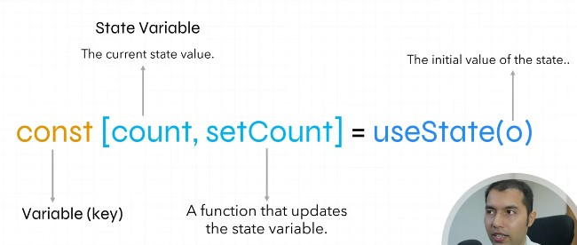

## React Hooks, useState Hook and Why we need it

## Why the Value updates of variable, but not Appeareance in the DOM in react
- It's because those are normal variables and React.js doesn't know that it's going to be changed.
- And that react should respond or update DOM based on that.
- Thos values are already rendered on DOM, there is no way they will be re-rendered.
- For that React.js provides a function called "useState"
- This type of function which starts with "use" is called hook.

## useState syntax

## Importance of Stats
