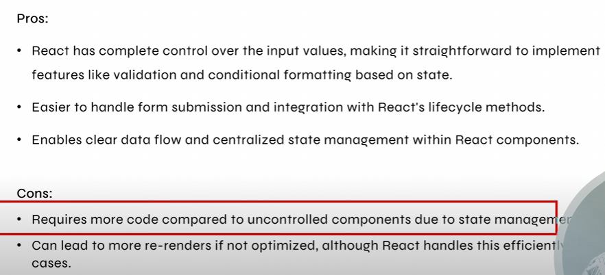

## Controlled Components
- Controlled components in React are those where form data is handled by React Component State using useState. The value of the input is set by React and changes through event handlers.

This means: 
1. State Management: The value of the input field is controlled by React state (useState)
- Example: const [inputValue, setInputValue] = useState('');

2. Event Handlers: Changes to the input field (like typing into a text field) are handled by React event handlers(onChange,onBlur,etc.)
- Example: <input type="text" value={inputValue} onChange={(e) => setInputValue(e.target.value)} />

3. State Updates: When the user interacts with the form input, React state is updated through the event handlers, and the input value reflects the current state value.
- Example: onChange={(e) => setInputValue(e.target.value)}

# Q. Why do we need to use the value={inputValue}
Because when the state gets updated, the value of the inputValue should also be reflected(same).
value={inputValue} → Displays the current state value in the input field.

## Pros and Cons of Controlled Components

## Uncontrolled Components
- An uncontrolled component uses a "useRef" to get the value directly from the DOM. React does not control the value, and it’s more like how we do things in plain HTML/JS.

This means:
1. Direct DOM Manipulation: The value of the input field is controlled by the DOM {document.getElementById,etc.}. It's not declarative way right.
2. Event Handling: In uncontrolled components, events like onChange can still be used, but the changes won't immediately update the React state. Instead, any change happens directly on the DOM element itself. 
3. Accessing Form Data: Form data is accessed through the "useRef".

