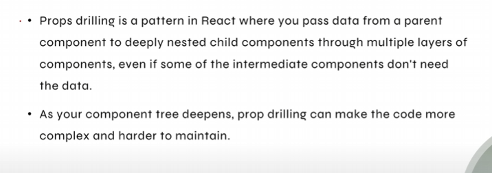
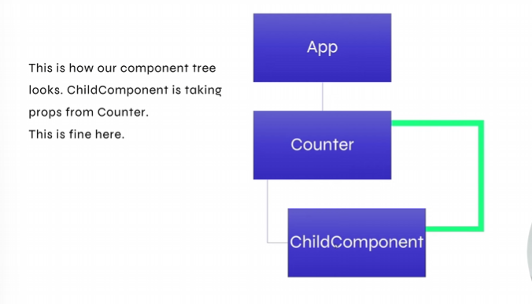
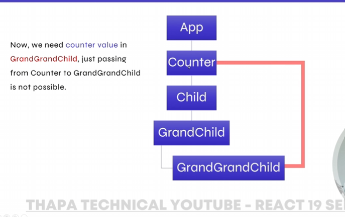
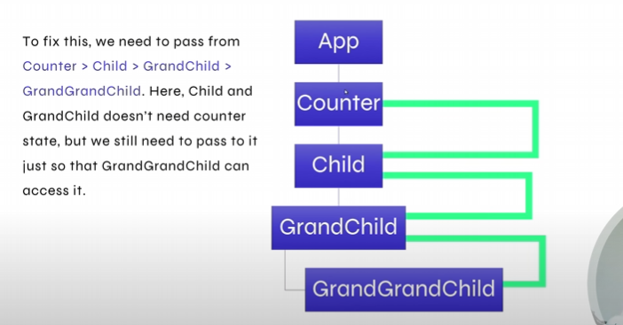
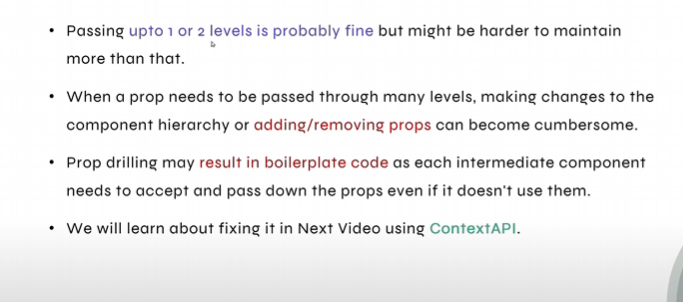
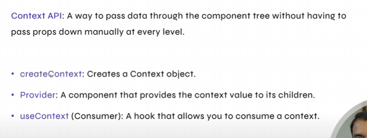
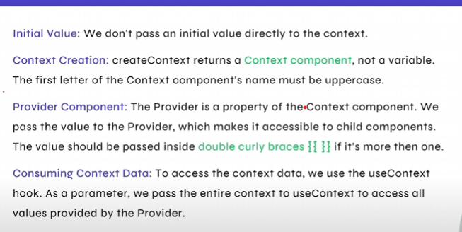

## Props Drilling 
Note => We are not going to use this Prop Drilling method as the props need to passed from every component, we are going to use the contextHook

## Context API

Note: The data's are passed from the 1.useContext to the 2.useContextMain
