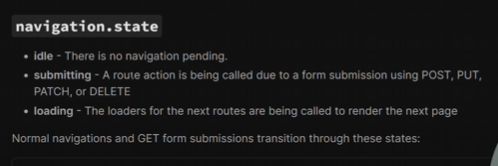

## Global Loading State
- useNavigation() has different functions but we are going to learn
- navigation.state which shows the loader until the api data is completely fetched.
- Rather than creating the loading state for all the Navbar components like About, Movies,etc. we can use only one which shows the "loader" to all the components.

## Steps
1. Go to AppLayout.jsx file under the components(Layout) folder.
2. Create the Loading.jsx file to style the loading under the Layout folder.

## To check the result of today code
1. Open DevTools(Inspect) in browser
- Right Click → Inspect or press Ctrl + Shift + I (Windows) / Cmd + Option + I (Mac)

2. Go to the Network tab.
- In the toolbar (near the top-left of the Network panel), find the "No throttling" dropdown.

- Change it to Slow 3G or Fast 3G — depending on how slow you want the requests.

- Keep the Network tab open, then go to your app and click your "Movies" navbar link.

- Now, your fetch requests will deliberately be delayed, and your loader should visibly show while the API call is pending. 

- Note => It will only show in "Movie" NavLink because Movies only fetches the data so it takes time.

## Explanation of navigation.state()
